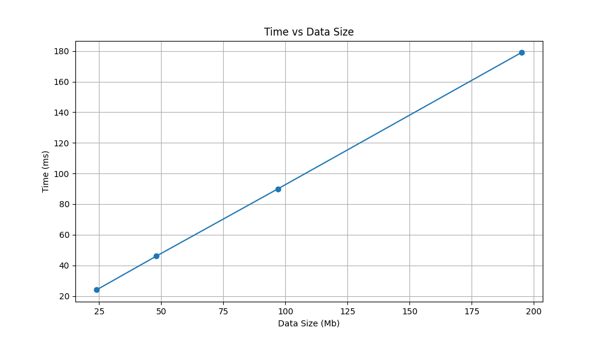

# Build & run


```
$ mpic++ transmit_time.c -o transmit_time
$ mpirun  transmit_time
```


# Transmission time

This tool is for measuring time of MPI communication.

It works in next way:

```
start timer

MPI_Recv(...) # transmission of N bytes

end timer
```

# Results


Results as plot:



From this data we can conclude that latency time
is about 2.3 ms.

And pure transmit speed is about 1100 Mb/s.

```
N = 1 Mb
Run time = 0.002 s
Speed = 500 Mb/s

N = 3 Mb
Run time = 0.002 s
Speed = 1500 Mb/s

N = 6 Mb
Run time = 0.005 s
Speed = 1200 Mb/s

N = 12 Mb
Run time = 0.011 s
Speed = 1090.91 Mb/s

N = 24 Mb
Run time = 0.023 s
Speed = 1043.48 Mb/s

N = 48 Mb
Run time = 0.047 s
Speed = 1021.28 Mb/s

N = 97 Mb
Run time = 0.09 s
Speed = 1077.78 Mb/s

N = 195 Mb
Run time = 0.179 s
Speed = 1089.39 Mb/s
```
